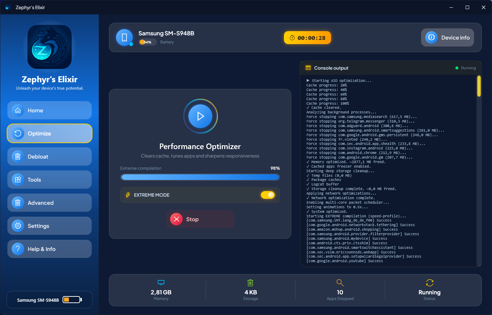
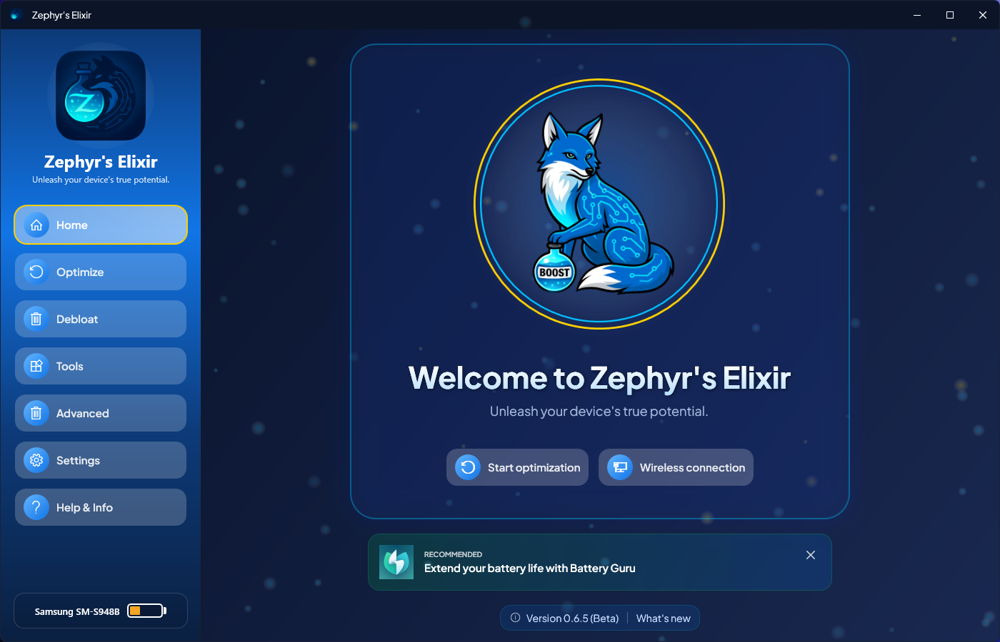
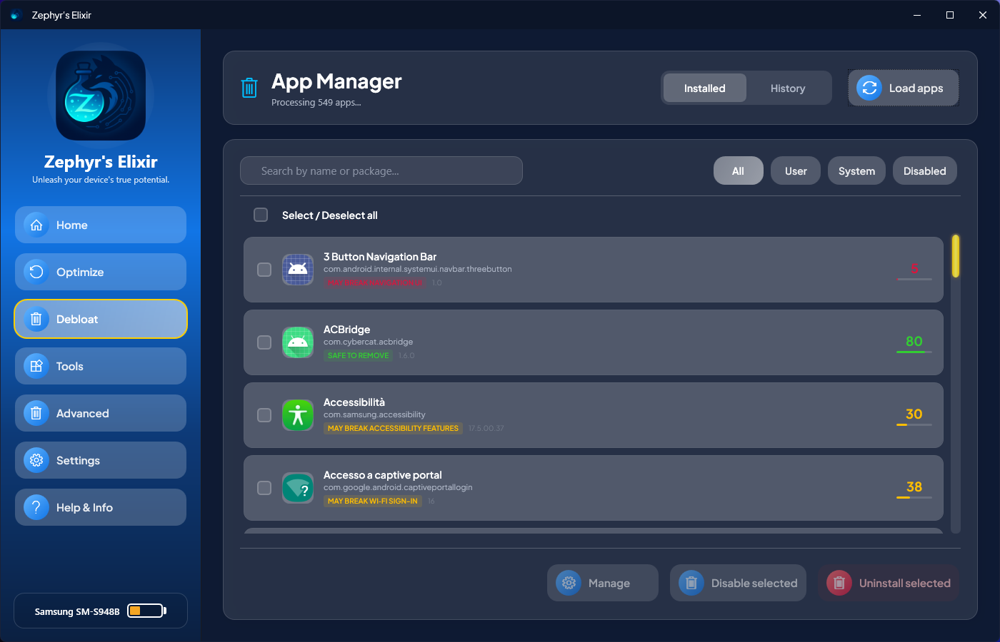
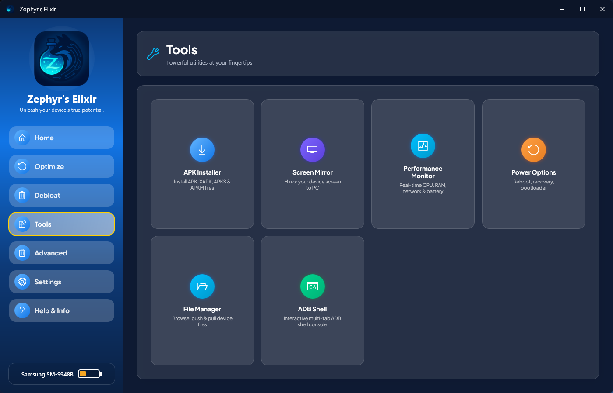
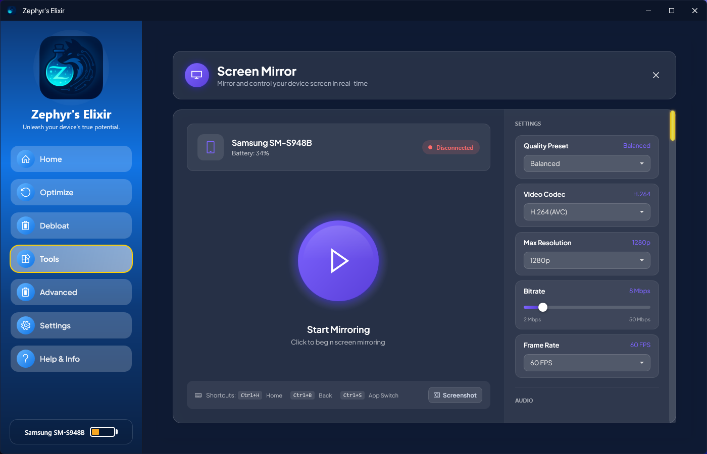
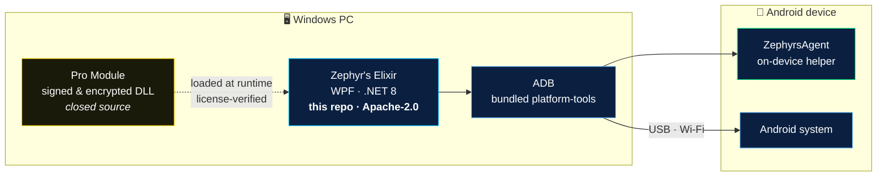

<div align="center">



### Take full control of your Android — from your PC. 🌀

Strip out bloatware, let AI expose the apps quietly tracking you, then bottle your whole
setup into a recipe you can pour over any phone in one tap — all over ADB, with
**no root, no account, and zero telemetry**.

<br>

[](https://www.zephyrselixir.com/#download)
[](LICENSE)
[](https://www.zephyrselixir.com/#download)
[](#-architecture--open-core)
[](https://github.com/blast752/zephyrs-elixir/stargazers)

[](https://www.zephyrselixir.com/#download)
[](https://www.zephyrselixir.com/guide)
[](https://www.zephyrselixir.com/purchase)
[](https://t.me/zephyrselixir)

<br>

<a href="https://www.zephyrselixir.com"></a>

<sub>**[Website](https://www.zephyrselixir.com)** · **[Features](#features)** · **[Pro](#pro)** · **[Screenshots](#screenshots)** · **[Quick Start](#quick-start)** · **[Architecture](#architecture)** · **[Contributing](#contributing)** · **[FAQ](#faq)**</sub>

</div>

---

## 🌀 What is Zephyr's Elixir?

**Zephyr's Elixir** is a free, open-source **Android debloater and optimization toolkit for Windows**. It talks to your phone over **ADB** — the same debugging bridge used by developers — to do what your manufacturer would rather you didn't: **remove pre-installed bloatware, disable hidden trackers, and squeeze real performance out of any Android device**, from Samsung and Xiaomi to Pixel and OnePlus. No root. No account. No telemetry. Just a gentle, thorough wind through your phone's system. 🍃

Like a zephyr, it's light — and like an elixir, it leaves your device feeling new.

|  |  |  |
|:---:|:---:|:---:|
| 💚 **100% Free Core** | 🔓 **No Root Required** | ⚖️ **Apache-2.0 Open Source** |
| Thirteen full tools, free forever — no ads, no tracking | Works over plain ADB on any Android 7.0+ with USB debugging | The entire desktop app you're reading about is in this repo |

<a id="features"></a>

## 🧰 The Free Toolkit — Free Forever

| Tool | What it does |
|------|--------------|
| 🗑️ **Complete Debloater** | Disable, uninstall, re-enable or restore any app without root — plus launch, force-stop, extract the APK or wipe the data of any of them. The **History tab** brings back anything you change your mind about, one app or a hundred at a time. |
| ⚡ **120-Step Optimizer** | One button runs a seven-stage pipeline — cache, memory, deep storage, network, system tuning, package compile and DEX — with **every ADB command streamed live** to the console. |
| 🧪 **Zephyr's Recipes** | Bundle an optimization, a debloat list, your tweaks and a stack of APKs into one recipe, then pour it over every phone you own in a single tap. Export it, or share it in the **community library**. |
| ⏳ **Time Vials** | Your settings are bottled before every optimization, recipe and tweak. Open a vial to see exactly what changed — and pour any single setting back. |
| 🤖 **AI Bloatware Intelligence** | A cloud AI rates every app **Safe, Caution or Critical** and exposes the spyware, ad-injectors and telemetry hiding in your system apps. 25 free scans a day. |
| 🛡️ **Private DNS** | Switch to NextDNS, AdGuard, Cloudflare, Google or Quad9 with live latency pings — or your own hostname — and block ads and trackers network-wide in two clicks. |
| 📡 **Wireless ADB** | Cut the cable. Full Wi-Fi control with Android 10 legacy mode and the Android 11+ pairing-code protocol — set up in ~30 seconds. |
| 🔀 **Multi-Device Control** | Plug in as many phones as you like and switch between them from the sidebar. Every page follows the active device — and a recipe runs on all of them at once. |
| 📦 **APK Installer** | Install APK, XAPK, APKS and APKM files directly, with automatic extraction for split-APK and bundle formats — and plain-language answers when Android refuses one. |
| 📁 **File Manager** | Browse your device's storage like a desktop explorer: copy, move, rename, delete, drag files both ways, filter as you type and see where your space went. |
| ⌨️ **ADB Shell Console** | A built-in, multi-tab interactive ADB shell with history, saved snippets and one-click session export. |
| 🔌 **Power Options** | Reboot to system, recovery, bootloader or fastbootd — and sideload OTA packages — without memorizing a single key combo. |
| 🎬 **Animation Control** | Drag one slider to speed up every system animation in lockstep, or switch them off for a UI that feels instant. |

<a id="pro"></a>

## ⭐ Zephyr's Elixir Pro

For those who want the storm, not just the breeze. Pro is delivered as a **separately signed, encrypted module** that is verified at runtime and bound to your device — and it funds the free core for everyone.

| Pro feature | What it unlocks |
|-------------|-----------------|
| 📊 **Performance Monitor** | CPU, RAM, **GPU, FPS**, network, storage and battery moving live — with the apps eating your memory ranked alongside, and a CSV export of the whole session. |
| ⚡ **Extreme Mode** | A deeper optimization pass: kills services, freezes cached apps, enables the multi-core scheduler and speed-compiles every package. |
| 🖥️ **Screen Mirror** | Low-latency mirroring with full mouse-and-keyboard control — locked to the device you picked, however many are plugged in. |
| 🎥 **Screen Recording** | Capture your device screen in high quality, straight from the mirror window. |
| 🛡️ **Privacy Suite** | One-click toggles to disable Safety Core, reset your Ad ID, block captive portals, rein in Play Services and switch off RAM expansion. |
| 💾 **APK Backup** | Automatically back up an app's APK — split bundles included — to your PC before you uninstall it. |
| 📥 **Multi-APK Install** | Queue and install multiple APKs — and split-APK bundles — in a single operation. |
| 🧪 **Pro Recipe Steps** | Extreme Mode, the privacy toggles and multi-APK installs, usable as steps inside your recipes. |
| 🤖 **Unlimited AI Scans** | No daily cap on AI bloatware analysis, plus priority support. |

<div align="center">

**From $3.33/month** — see plans on the **[purchase page](https://www.zephyrselixir.com/purchase)** ⭐

</div>

<a id="screenshots"></a>

## 📸 A Look Inside

<div align="center">

| | |
|:---:|:---:|
| <br><sub>**Home** — your device at a glance</sub> | <br><sub>**Debloat** — AI-rated app removal</sub> |
| <br><sub>**Tools** — installer, files, shell & more</sub> | <br><sub>**Screen Mirror** — control your phone from your PC ⭐</sub> |

<sub>More in the **[illustrated user guide →](https://www.zephyrselixir.com/guide)**</sub>

</div>

<a id="quick-start"></a>

## 🚀 Quick Start

> **You need:** a Windows 10/11 (x64) PC · an Android phone · a USB cable (or Wi-Fi for Wireless ADB). ADB itself ships inside the app — nothing else to install.

1. **[Download the installer](https://www.zephyrselixir.com/#download)** and run it.
2. On your phone, enable **Developer Options → USB debugging** *(tap Build Number 7 times — the [guide](https://www.zephyrselixir.com/guide) walks you through it with pictures)*.
3. Plug in, accept the **"Allow USB debugging?"** prompt on the phone, and you're connected.
4. Pick your potion: 🗑️ **Debloat**, ⚡ **Optimize**, or explore the 🧰 **Tools**.
5. Happy with the result? Bottle it as a 🧪 **recipe** — the next phone takes one tap.

### 🔧 Build from source

```bash
git clone https://github.com/blast752/zephyrs-elixir.git
cd zephyrs-elixir
dotnet build -c Release
# → bin/Release/net8.0-windows/ZephyrsElixir.exe
```

Requires the [.NET 8 SDK](https://dotnet.microsoft.com/download/dotnet/8.0) on Windows. The open-source app **builds and runs fully without the Pro module** — Pro simply lights up extra features when a licensed module is present.

<a id="architecture"></a>

## 🏗️ Architecture & Open Core

Zephyr's Elixir follows an **open-core model** — the same approach used by GitLab, Mattermost and many other projects. Everything the free app does lives in this repository under **Apache-2.0**. Pro features live in a separate, closed-source module that the app loads at runtime after license verification.



| Component | What it is | License |
|-----------|------------|---------|
| **Desktop app** (this repo) | The complete WPF application: debloater, optimizer, recipe engine, tools, licensing bridge, localization | Apache-2.0 ✅ |
| **ZephyrsAgent** | On-device helper the app deploys over ADB for richer device data | Bundled with the app |
| **Recipe marketplace API** | Serverless endpoint backing the community library — the client that talks to it lives in this repo | Hosted service |
| **Pro module** | Performance Monitor, Screen Mirror & co. — distributed via [zephyrselixir.com](https://www.zephyrselixir.com/purchase) | Proprietary ⭐ |

**Why open core?** You can audit every command the free app ever sends to your phone — a tool that promises *zero telemetry* should let you check. Pro funds the development of both.

🌍 **Localization:** English and Italiano ship today — the app is fully resource-localized (`Localization/`), so new languages are easy contributions.

<a id="contributing"></a>

## 🤝 Contributing

Every kind of wind moves the project forward:

- 🐛 **Found a bug?** [Open an issue](https://github.com/blast752/zephyrs-elixir/issues) with your Windows + Android versions and what happened.
- 💡 **Have an idea?** Come talk in the [Telegram community](https://t.me/zephyrselixir) — features are discussed there first.
- 🔀 **Want to code?** Fork → branch → PR. Keep PRs focused, match the existing code style, and make sure `dotnet build -c Release` is clean.
- 🌐 **Speak another language?** Add a `Strings.<lang>.resx` — translations are the friendliest first PR.

📜 History lives in the **[changelog](https://www.zephyrselixir.com/changelog)** · 🔄 updates in the **[release feed](https://www.zephyrselixir.com/updates)**.

<a id="faq"></a>

## ❓ FAQ

<details>
<summary><b>Do I need to root my phone?</b></summary>
<br>

No. Everything works over plain **ADB (Android Debug Bridge)** with USB debugging enabled — the official mechanism Android exposes to developers. Your warranty-sensitive bits stay untouched.
</details>

<details>
<summary><b>Is debloating safe? What if I remove the wrong app?</b></summary>
<br>

The debloater keeps a **History tab** — anything you disable or uninstall can be restored in one click. The **AI risk ratings** (Safe / Caution / Critical) tell you what's a tracker and what's load-bearing before you touch it, and the console shows you every command as it runs. Nothing happens behind your back.
</details>

<details>
<summary><b>Which devices are supported?</b></summary>
<br>

Any Android 7.0 or newer phone or tablet that supports USB debugging — Samsung, Xiaomi, OnePlus, Pixel, Motorola, and everything in between. Wireless ADB needs Android 10+ (pairing-code flow on Android 11+).
</details>

<details>
<summary><b>Is the whole app really open source?</b></summary>
<br>

The **entire free application** — everything described in the free toolkit above, including the license bridge itself — is in this repo under Apache-2.0. The **Pro module** is a separate closed-source add-on: that's the <a href="#architecture">open-core model</a> that keeps the free tool free.
</details>

<details>
<summary><b>What data does it collect?</b></summary>
<br>

The app has **zero telemetry, no ads, and needs no account**. The only network calls it makes are the ones that serve you: the optional cloud AI scan, update checks, the Pro license check if you buy Pro, and the community recipe library if you open that tab. Your recipes and your Time Vials stay on your PC unless you press **Share**. See the <a href="https://www.zephyrselixir.com/privacy">privacy policy</a>.
</details>

<details>
<summary><b>What is a recipe?</b></summary>
<br>

A small `.zerecipe` file describing what you want done to a phone: an optimization, apps to uninstall or disable, tweaks like Private DNS and animation speed, and APKs to install. Press **Run**, pick your devices, and it replays all of it in order — on several phones in parallel if you like. Export it, import it, or publish it to the community library; Pro only gates three ingredients (Extreme mode, the privacy toggles, multi-APK installs), and a recipe using them still runs without Pro — those steps are reported as skipped.
</details>

<details>
<summary><b>What are Time Vials?</b></summary>
<br>

Automatic snapshots of the device's system settings, bottled before every optimization, recipe and advanced tweak. Open one to see exactly what changed since then and pour any single setting back. Fifteen are kept per device, on your PC only, and the handful of keys that would cut the ADB connection (USB debugging among them) are shown but never rewritten.
</details>

## 💙 Support the Project

If Zephyr's Elixir gave your Android a second wind, the best ways to send some back:

<div align="center">

⭐ **[Star this repo](https://github.com/blast752/zephyrs-elixir/stargazers)** — it's the wind in the project's sails<br>
📣 Share it with someone whose phone is drowning in bloatware<br>
💬 Join the **[Telegram](https://t.me/zephyrselixir)** · ⭐ Go **[Pro](https://www.zephyrselixir.com/purchase)** to fund the free core

<br>

<a href="https://www.star-history.com/#blast752/zephyrs-elixir&Date">
  <picture>
    <source media="(prefers-color-scheme: dark)" srcset="https://api.star-history.com/svg?repos=blast752/zephyrs-elixir&type=Date&theme=dark">
    <source media="(prefers-color-scheme: light)" srcset="https://api.star-history.com/svg?repos=blast752/zephyrs-elixir&type=Date">
    
  </picture>
</a>

</div>

## ⚖️ License & Legal

- The desktop application in this repository is licensed under **[Apache-2.0](LICENSE)**.
- The **Pro module** is proprietary software distributed separately via [zephyrselixir.com](https://www.zephyrselixir.com).
- [Privacy Policy](https://www.zephyrselixir.com/privacy) · [Terms of Service](https://www.zephyrselixir.com/terms)
- Android is a trademark of Google LLC. Zephyr's Elixir is an independent project, not affiliated with or endorsed by Google. You modify your own device at your own discretion — the History tab has your back.

---

<div align="center">

**Zephyr's Elixir** — crafted with 💙 by [Blast752](https://github.com/blast752) · [zephyrselixir@gmail.com](mailto:zephyrselixir@gmail.com)

*May a fair wind clear your phone.* 🌀

<sub>[⬆️ Back to top](#-what-is-zephyrs-elixir)</sub>

</div>
